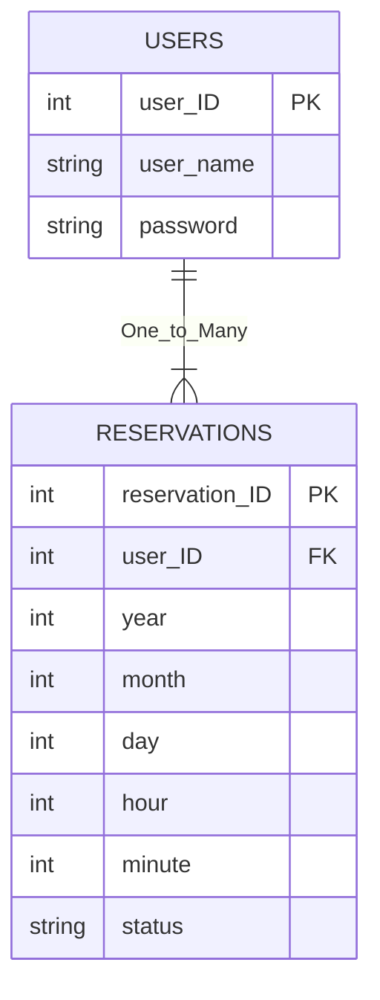

# Welcome to the Reservation Scheduler. 

The general goal of this project is to build a simple service to help users make reservations to go to a fancy melon tasting. More information can be found in this repo's wiki.

# Database Structure

Two PostgreSQL Tables, Users and Reservations hold the data regarding users and scheduled reservations.

